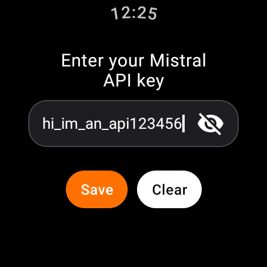

# Wearstral

A native Wear OS client for chatting with [Mistral AI](https://mistral.ai) models through the Mistral API.  
Built with Kotlin and Compose for Wear OS; voice and keyboard input (soon), streaming replies (soon), round-screen layouts. 
From your wearOS system settings, you will also (soon) be able to set Wearstral as your main assistant instead of, let's say, Gemini.

This is **not** an official Mistral project. It does not wrap chat.mistral.ai; it talks directly to
`api.mistral.ai` using an API key that you create yourself at [console.mistral.ai/api-keys](https://console.mistral.ai/api-keys).  
Later, I will try to add support for people that don't use their API or that pay for the pro sub like me.

---

<p align="center">
  
</p>

---

## Status

Early development! The scaffold builds and installs; the API key screen (keyboard entry, DataStore storage, swipe navigation) works :)

## Roadmap

1. Wear OS + Compose scaffold -> OK
2. API key set up screen -> OK
3. Safe local API storage
3. Single conversation with non-streaming replies
4. Possibility to pick it as main assitant
4. SSE streaming responses with haptic feedback
5. Conversation history, model picker, round-screen polish

## Building

```shell
./gradlew assembleDebug
```

Requires the Android SDK (API 36) and JDK 17+ 

## License

Obviously [GPL-3.0](LICENSE) :P
