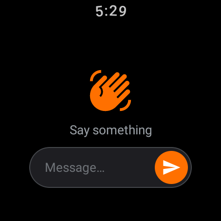
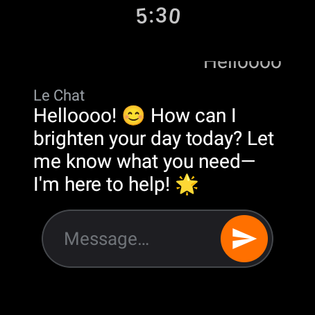
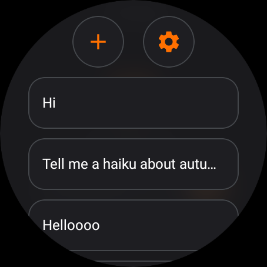
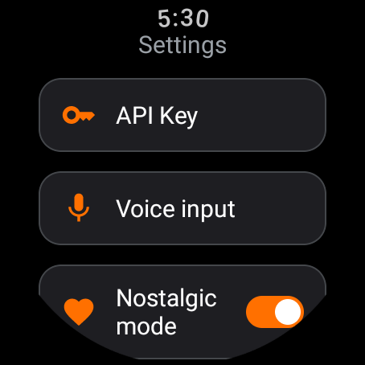
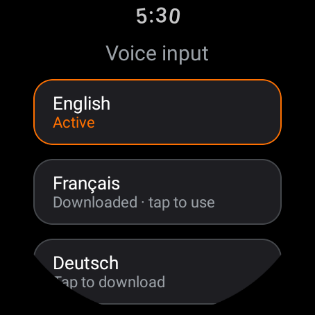
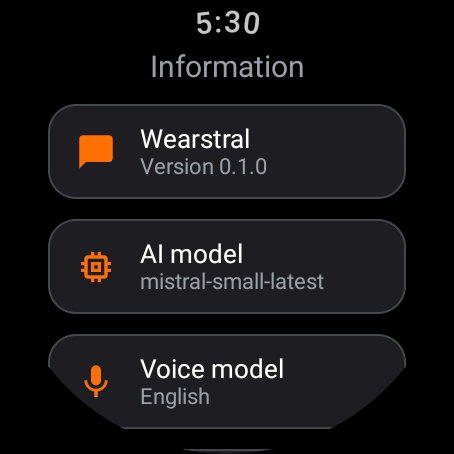

# Wearstral

A native Wear OS client for chatting with [Mistral AI](https://mistral.ai) models through the Mistral API.
Built with Kotlin and Compose for Wear OS, designed for round displays ! 

Chat from your wrist with **keyboard or on-device voice input**,
keep a **persistent chat history**, and get **Markdown-formatted answers** all in a UI built for the
small round screen.

This is **not** an official Mistral project and it's not affiliated to them in any way. It does not wrap chat.mistral.ai; it talks directly to
`api.mistral.ai` using an API key that you create yourself at [console.mistral.ai/api-keys](https://console.mistral.ai/api-keys).
Later, I will try to add support for people that don't want to use their API or that pay for the pro sub like me and would benefit from that.

---

## Screenshots

| Home | Chat | Side panel |
|:---:|:---:|:---:|
|  |  |  |
| **Settings** | **Voice input** | **Information** |
|  |  |  |

---

## Features

- **Chat**: conversations with Mistral models, replies rendered with light Markdown (bold, italic,
  strikethrough, inline code, bullet lists), a thinking indicator while waiting, and haptics-friendly
  round-screen layout.
- **Voice input**: long-press the send button to dictate, tap again to stop. Transcription runs
  fully on-device with [Vosk](https://alphacephei.com/vosk/) models (~30-50 MB) which are
  downloaded from within the app and never send your audio anywhere. The transcript lands in the
  message field for review
- **Chat history**: conversations persist on the watch across restarts. Reopen them from the side
  panel or the full history screen, long-press a chat to **pin** it or **delete** it,
  and wipe everything from Settings if needed.
- **Side panel**: swipe from the right edge for a new chat, settings, and recent conversations.
- **API key storage**: the key is stored encrypted on the device and never leaves it (except
  obviously to talk to the Mistral servers).
- **BYOK**: create a free API key at [console.mistral.ai/api-keys](https://console.mistral.ai/api-keys)
  and paste it once and... you're set ! :D

## Status

Early development, but very very usable! :) 

## Roadmap

1.  Wear OS + Compose scaffold -> OK
2.  API key set up screen -> OK
3.  Safe local API storage -> OK
4.  Single conversation with non-streaming replies -> OK
5.  Conversation history -> OK
6.  Voice input -> OK
7.  Possibility to pick it as main assistant 
8.  SSE streaming responses with haptic feedback
9.  Model picker
10. Add support for other AI providers via API key (Anthropic, Google, OpenAI, Mammouth AI, OpenRouter,...)
11. Add possibility to use a very small local LLM, that will run on-device exclusively

## Building

```shell
./gradlew assembleDebug
```

Requires the Android SDK (API 33+, target API 36) and JDK 17+.
Install it on a watch or emulator:

```shell
adb install app/build/outputs/apk/debug/app-debug.apk
```

## License

Obviously [GPL-3.0](LICENSE) :P
